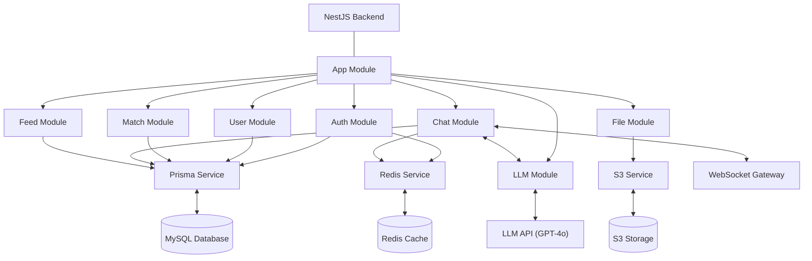
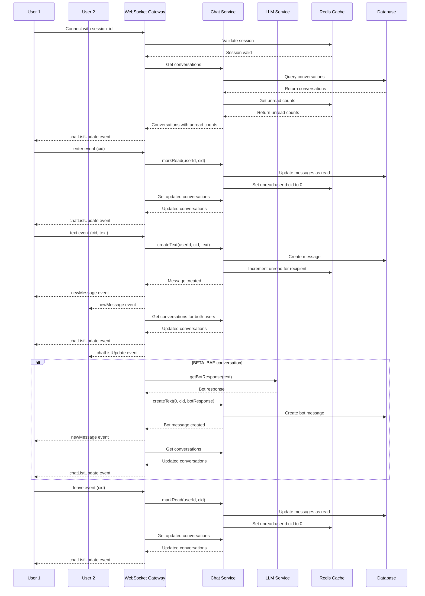

# BetaBae Backend

## Tech Stack

- **Framework**: [NestJS](https://nestjs.com/) (TypeScript)
- **Database**: MySQL with [Prisma ORM](https://www.prisma.io/)
- **Cache & Session**: [Redis](https://redis.io/) via [ioredis](https://github.com/redis/ioredis)
- **Storage**: AWS S3/MinIO for file storage
- **Authentication**: Custom cookie-based session management
- **Real-time Communication**: WebSockets via Socket.IO
- **AI Integration**: LLM service for BetaBae chat bot
- **Validation**: Class-validator for DTO validation
- **Containerization**: Docker & Docker Compose for development environment

## System Architecture

BetaBae follows a modular architecture based on NestJS modules. The system is designed with clean separation of concerns and dependency injection.



## Project Structure

```
src/
├── app.module.ts              # Main application module
├── main.ts                    # Application entry point
├── dto/                       # Data Transfer Objects
│   ├── auth/                  # Authentication-related DTOs
│   ├── chat/                  # Chat-related DTOs
│   ├── common/                # Shared DTOs
│   ├── file/                  # File-related DTOs
│   ├── match/                 # Match-related DTOs
│   └── user/                  # User-related DTOs
├── enums/                     # Enum definitions
├── filters/                   # Exception filters
├── infra/                     # Infrastructure services
│   ├── prisma/                # Prisma ORM configuration and schema
│   ├── redis/                 # Redis configuration
│   └── s3/                    # S3/MinIO configuration
├── middleware/                # Application middleware
└── modules/                   # Feature modules
    ├── auth/                  # Authentication module
    ├── chat/                  # Chat module
    ├── file/                  # File module
    ├── match/                 # Match module
    └── user/                  # User module
```

## Prerequisites

- Node.js (v18+)
- Docker and Docker Compose
- Yarn package manager

## Getting Started

### 1. Clone the Repository

```bash
git clone <repository-url>
cd betabae/app/backend
```

### 2. Environment Setup

Copy the example environment file and configure it for your environment:

```bash
cp .env.example .env
```

Edit the `.env` file to configure:

- Database connection parameters
- Redis connection details
- S3/MinIO credentials
- Other environment-specific settings

### 3. Start Infrastructure Services

From the project root:

```bash
# Start required services (MySQL, Redis, MinIO)
cd ../../
make up
```

### 4. Install Dependencies

```bash
# Install backend dependencies
make install
# or
cd app/backend
yarn install
```

### 5. Database Setup

Initialize the database with Prisma:

```bash
yarn prisma:generate    # Generate Prisma client
yarn prisma:migrate     # Apply migrations
```

### 6. Run the Application

```bash
# Development mode with hot-reload
yarn start:dev

# Production build
yarn build
yarn start:prod
```

The server will be available at http://localhost:3000 by default.

## API Endpoints

### Authentication

- `POST /auth/register` - Register a new user
- `POST /auth/login` - Log in an existing user
- `POST /auth/logout` - Log out the current user

### User Management

- `GET /user/profile` - Get current user's profile
- `PUT /user/profile` - Update current user's profile
- `GET /user/personality` - Get current user's personality data
- `PUT /user/personality` - Update current user's personality data
- `PUT /user/credential` - Update current user's password

### File Management

- `POST /file` - Upload a file with context information
- `DELETE /file/:id` - Delete a file by ID

### Match Management

- `POST /match` - Create a new match
- `GET /match` - Get all matches for current user
- `GET /match/received` - Get received match requests
- `POST /match/:id/accept` - Accept a match request
- `POST /match/:id/reject` - Reject a match request

### Chat Management

#### Real-Time Chat Architecture

The chat system implements real-time functionality using WebSockets with the following features:



#### Chat APIs

- `GET /chat/conversations` - Get all conversations for current user
- `GET /chat/conversations/:conversationId` - Get a specific conversation
- `GET /chat/conversations/:conversationId/messages` - Get messages for a conversation
- `POST /chat/conversations/:conversationId/messages/text` - Send a text message
- `POST /chat/conversations/:conversationId/messages/image` - Send an image message

#### BetaBae Clone APIs
- `POST /llm-clone/create` - Creates beta-bae clone
- `POST /llm-clone/update` - Updates beta-bae clone
- `POST /llm-clone/delete` - Deletes beta-bae clone

#### WebSocket Events

- `WS /chat` - WebSocket namespace for real-time chat functionality
  - `connect` - Client connects to WebSocket server (requires valid session_id cookie)
  - `enter` - Client enters a chat room (marks messages as read)
  - `leave` - Client leaves a chat room (marks messages as read)
  - `text` - Client sends a text message
  - `newMessage` - Server broadcasts new message to clients in a conversation
  - `chatListUpdate` - Server sends updated chat list to clients

## Testing

```bash
# Unit tests
yarn test

# E2E tests
yarn test:e2e

# Test coverage
yarn test:cov
```

## Development Workflow

1. Create feature branches from main
2. Make changes and add tests
3. Run tests to ensure everything works
4. Create a pull request for review

## Available Scripts

- `yarn start:dev` - Run in development mode with hot reload
- `yarn build` - Build the application
- `yarn start:prod` - Run the built application
- `yarn prisma:generate` - Generate Prisma client
- `yarn prisma:migrate` - Apply database migrations
- `yarn prisma:studio` - Open Prisma Studio for database management
- `yarn lint` - Lint the codebase
- `yarn test` - Run tests

## Environment Variables for Development

| Variable             | Description                       | Default               |
| -------------------- | --------------------------------- | --------------------- |
| NODE_ENV             | Environment mode                  | development           |
| PORT                 | Application port                  | 3000                  |
| DB_HOST              | Database host                     | localhost             |
| DB_PORT              | Database port                     | 3306                  |
| DB_USERNAME          | Database username                 | root                  |
| DB_PASSWORD          | Database password                 | 1234                  |
| DB_DATABASE          | Database name                     | betabae               |
| DATABASE_URL         | Prisma database connection string | -                     |
| REDIS_HOST           | Redis server host                 | localhost             |
| REDIS_PORT           | Redis server port                 | 6379                  |
| REDIS_PASSWORD       | Redis password                    | betabae               |
| S3_REGION            | S3/MinIO region                   | kr-east-1             |
| S3_BUCKET_NAME       | S3/MinIO bucket name              | betabae               |
| S3_ACCESS_KEY_ID     | S3/MinIO access key               | minioadmin            |
| S3_SECRET_ACCESS_KEY | S3/MinIO secret key               | minioadmin            |
| S3_ENDPOINT          | S3/MinIO endpoint (for local dev) | http://localhost:9000 |
| API_KEY              | LLM API key                       | https://api.openai.com/v1/chat/completions |

